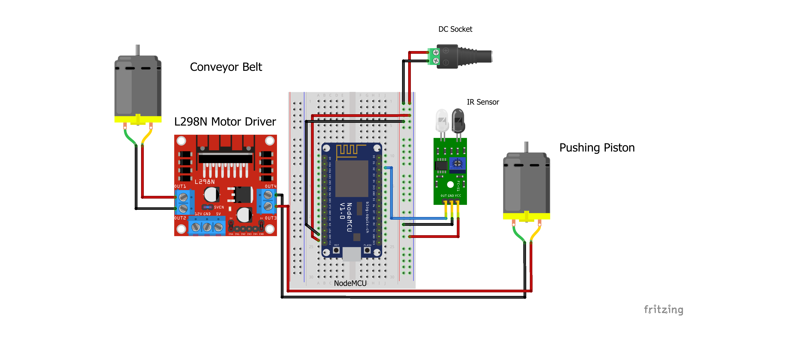

# 🛠️ Fault Detector with ESP32 & OpenCV using MQTT

## 📖 About

This project is an intelligent fault detection and rejection system built using an **ESP32**, **OpenCV**, and **MQTT** protocol. It leverages computer vision to identify faulty objects based on color using HSV thresholds and automatically removes them from a **self-built conveyor belt** mechanism.

The ESP32 wirelessly communicates with a Python-based system running OpenCV, which acts as a controller by detecting colored defects and sending MQTT commands. Upon receiving a fault signal, the ESP32 checks for object presence using **IR sensors** and activates a **CD drive motor-based pusher** to eject the object from the conveyor.

---

## ✨ Features

- 🔍 Real-time HSV-based color detection using OpenCV
- 📡 MQTT communication between Python system and ESP32
- 🤖 IR sensor object detection to validate object presence
- 🔧 Old CD-ROM drive used as motorized ejector
- ♻️ Fully wireless and modular system
- 🛠️ DIY Conveyor belt integration

---

## 🧰 Tech Stack

- **ESP32 (Arduino/C++)**
- **OpenCV (Python)**
- **paho-mqtt (Python)**
- **MQTT Broker (e.g., Mosquitto)**
- **IR Sensor (x2)**
- **Old CD/DVD Drive Motor**
- **3D Printed / Custom Conveyor Belt**

---

## ⚙️ System Requirements

- Python 3.x
- OpenCV (`cv2`)
- paho-mqtt (`pip install paho-mqtt`)
- Mosquitto MQTT broker (local or cloud)
- Arduino IDE (for ESP32 code)

---

## 🧠 How it Works

1. **OpenCV System:**
   - A camera continuously monitors the conveyor belt.
   - It uses **HSV color detection** to identify defective (or faulty) items based on color.
   - If a fault is detected, it publishes a `"FAULT"` command to a predefined MQTT topic.

2. **ESP32 Subscriber:**
   - Subscribes to the same MQTT topic.
   - On receiving `"FAULT"`, it activates the IR sensors to confirm object presence.
   - If the object is present, it triggers a **CD drive motor** to push the object off the conveyor belt.

3. **Object Removal:**
   - The pusher (salvaged from a CD/DVD drive) removes the defective item.
   - System resets to wait for the next item.

---

## 🖥️ Installation and Setup

### ESP32 Setup

1. Flash the ESP32 with the Arduino sketch (`.ino` file in this repo).
2. Ensure WiFi credentials and MQTT broker address are set in the code.
3. Connect IR sensors and motor as per wiring diagram (provided in `/docs` or repo images).

### Python OpenCV System

```bash
git clone https://github.com/your-username/fault-detector-esp32-opencv.git
cd fault-detector-esp32-opencv
pip install opencv-python paho-mqtt
python detect_fault.py
```

<br>

## 📷 Demo

Below is a sample footage of how it's supposed to work:<br>

https://user-images.githubusercontent.com/56502015/138217969-9933b864-b6ca-47a5-a63f-899a588952dc.mp4

📡 MQTT Topic Structure
Topic	Message	Purpose
object/fault	FAULT	Instructs ESP32 to eject item

## 🚀 Future Improvements

Add OLED display to ESP32 for status

- Integrate object tracking for multi-object handling
- Enhance conveyor control (PWM/DC Motor with ESC)
- Improve mechanical pusher mechanism

## 📄 License
This project is licensed under the MIT License - see the LICENSE file for details.

